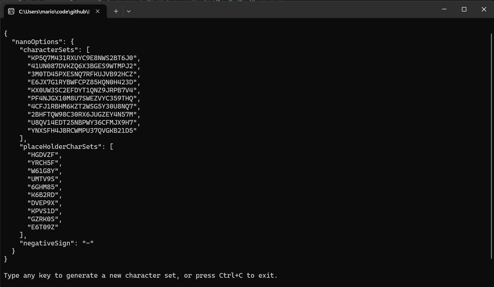
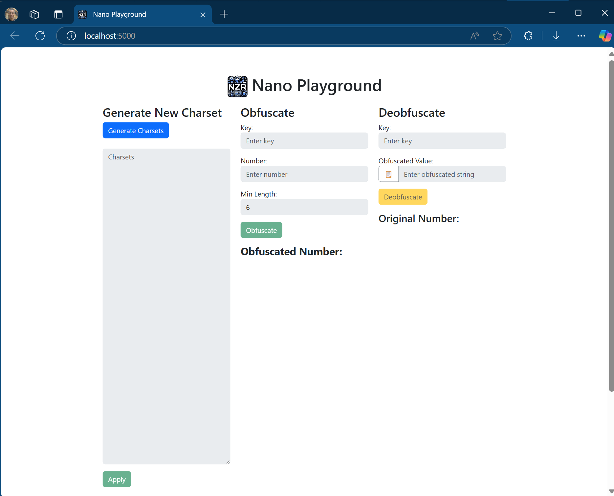

# Nzr.Nano


Nzr.Nano is a lightweight and configurable library for obfuscating and deobfuscating numeric values effortlessly. Whether you're protecting sensitive data like IDs, transaction numbers, or other numeric identifiers, Nzr.Nano offers a clean, intuitive API that integrates seamlessly with any .NET application.

It relies on a pre-configured set of characters and placeholders to produce short, fixed-length strings from numeric values. This makes it an ideal choice for exposing identifiers in frontend applications, offering a clean and concise alternative to GUIDs while maintaining uniqueness and security.

With its customizable character sets and placeholder configurations, Nzr.Nano empowers you to tailor obfuscation to your exact needs, ensuring unique and secure outputs with customizable sizes. This makes identifiers easier for end-users to read and remember, even for large numbers.

To simplify the creation of character sets, we provide **Nzr.Nano.Generator** and **Nzr.Nano.Playground** (which includes the Generator), so you can experiment and find the configuration that works best for you.

---

## Overview

### Example without Nano class directly, after initialization

```csharp
public record ProductCategory(long Id);
public record Product(long Id, ProductCategory Category);

// Let's assume that by coincidence, the category and product have the same ID.
var category = new ProductCategory(id: 2097483047);
var product = new Product(id: 2097483047);

string opId = Nano.Obfuscate(product.Id, "banana1");
Console.WriteLine(opId); // Output: Z7YXXRX

string ocId = Nano.Obfuscate(product.Category.Id, "apple1");
Console.WriteLine(opId); // Output: 0N14424

var pId = Nano.Deobfuscate("banana1", opId);
Console.WriteLine(pId); // Output: 2097483047

var cId = Nano.Deobfuscate("apple1", ocId);
Console.WriteLine(pId); // Output: 2097483047
```

### Example using the `NanoKeyAttribute` and extension methods

```csharp
[NanoKey("apple1")]
public record ProductCategory(long Id);

[NanoKey("banana1")]
public record Product(long Id, ProductCategory Category);

// Let's assume that by coincidence, the category and product have the same ID.
var category = new ProductCategory(id: 2097483047);
var product = new Product(id: 2097483047);

string opId = product.Id.Obfuscate<Product>();
Console.WriteLine(opId); // Output: Z7YXXRX

string ocId = product.Category.Id<ProductCategory>();
Console.WriteLine(opId); // Output: 60B11M1

var pId = ocId.Deobfuscate<Product>();
Console.WriteLine(pId); // Output: 2097483047

var cId = ocId.Deobfuscate<ProductCategory>();
Console.WriteLine(pId); // Output: 2097483047
```

### Consistent output 

No matter if the number is small or large, positive or negative, the output will length be consistent (depending on the minimum size set and the size of the number)
Previous examples, used the default configuration, which has a minimum size of 6 characters.
Here is how it works with a different configuration:

```csharp
Nano.Obfuscate(603, "banana1", 4); // XTK1
Nano.Obfuscate(15981, "banana1", 4); // XPGD
Nano.Obfuscate(411273, "banana1", 4); // X44T

// When if the number is large, the output will have to be larger to accommodate it
Nano.Obfuscate(10693240, "banana1", 4); // XX4442

// Negative numbers are also supported, but the output will be larger to accommodate the negative sign
Nano.Obfuscate(-1, "banana1", 4); // -5J1V
```


This project includes four key components:

1. **Nzr.Nano** - The core library for obfuscation and deobfuscation.
2. **Nzr.Nano.Generator** - A tool to generate valid character and placeholder sets (charsets).
3. **Nzr.Nano.Playground** - A web application to experiment with charset configurations and obfuscation/deobfuscation methods.
4. **Nzr.Nano.Demo** - A web API to showcase the usage of Nano.

---

## Getting Started

### Installation
To install the core Nzr.Nano library, use the NuGet Package Manager:

```
Install-Package Nzr.Nano
```

or

```bash
dotnet add package Nzr.Nano
```

To use the generator, playground, or demo, clone the repository and build and run the respective projects.

---

## Nzr.Nano.Generator



### Overview
`Nzr.Nano.Generator` is a class library/console application designed to help you create valid character and placeholder sets for use with the Nzr.Nano library. The generated charsets can be saved in a configuration file (e.g., `appsettings.json`) and used to initialize `Nano` with `NanoOptions`.

### How to Use

#### Step 1: Generate Charsets

Run `Nzr.Nano.Generator`, and it will output random valid charsets. Alternatively, you can generate charsets programmatically using the `NanoGenerator.Generate` method:

```csharp
using Nzr.Nano.Generator;

var settings = NanoGenerator.Generate();

// Output the generated settings as JSON
var json = JsonSerializer.Serialize(settings, new JsonSerializerOptions { WriteIndented = true });
Console.WriteLine(json);
```

#### Step 2: Save Charsets to appsettings.json
Copy the generated JSON and add it to your `appsettings.json` under a section named `NanoOptions`:

```json
{
  "nanoOptions": {
    "characterSets": [
      "KP5Q7M431RXUYC9E8NWS2BT6J0",
      "41UN087DVKZQ6X3BGES9WTMPJ2",
      "3M0TD45PXESNQ7RFKUJVB92HCZ",
      "E6JX7G1RYBWFCPZ85KQN0H423D",
      "KX0UW3SC2EFDYT1QNZ9JRPB7V4",
      "PF4NJGX10M8U7SWEZVYC359THQ",
      "4CFJ1RBHM6KZT2WSG5Y30U8NQ7",
      "2BHFTQW98C30RX6JUGZEY4N57M",
      "U8QV14EDT25NBPWY36CFMJX9H7",
      "YNXSFH4J8RCWMPU37QVGKB21D5"
    ],
    "placeHolderCharSets": [
      "HGDVZF",
      "YRCH5F",
      "W61G8Y",
      "UMTV9S",
      "6GHM85",
      "K6B2RD",
      "DVEP9X",
      "KPVS1D",
      "GZRK0S",
      "E6T09Z"
    ],
    "negativeSign": "-"
  }
}
```

#### Step 3: Initialize Nano
Read the `NanoOptions` from the configuration file to initialize `Nano`:

```csharp
using Microsoft.Extensions.Configuration;
using Nzr.Nano;

// Build configuration
var configuration = new ConfigurationBuilder()
    .AddJsonFile("appsettings.json")
    .Build();

// Bind NanoOptions from configuration
var nanoOptions = configuration.GetSection("NanoOptions").Get<NanoOptions>();

// Initialize Nano
Nano.Initialze(nanoOptions);
```

Once Nano is initialized, you can start using it.

---

## Nzr.Nano.Playground



### Overview
`Nzr.Nano.Playground` is a web-based application that allows you to use the Nzr.Nano.Generator and Nzr.Nano to test charsets and obfuscation methods.

### How to Use

1. Clone the repository: `git clone https://github.com/marionzr/nzr.nano.git`
2. Build and run the `Nzr.Nano.Playground` project.
3. Access the application in your browser (e.g., `http://localhost:5000`).
4. **Generate Charsets**
   - Click the "Generate Charsets" button to create a new set of character and placeholder sets.
   - If you modify it, click on the "Apply" button.
5. Test Obfuscation and Deobfuscation
   - Use the obfuscation and deobfuscation sections to test your charset configurations.
6. Save the Charsets
   - Copy the generated JSON and add it to your `appsettings.json`.

---

## Nzr.Nano.Demo

Check the `Nzr.Nano.Demo` project for examples on how to use the Nzr.Nano library.

---

## Contributing
Contributions are welcome! Feel free to submit issues or pull requests.

---

## License
Nzr.Nano is licensed under the Apache License, Version 2.0, January 2004. You may obtain a copy of the License at:

```
http://www.apache.org/licenses/LICENSE-2.0
```

# Disclaimer

This project is provided "as-is" without any warranty or guarantee of its functionality. The author assumes no responsibility or liability for any issues, damages, or consequences arising from the use of this code, whether direct or indirect. By using this project, you agree that you are solely responsible for any risks associated with its use, and you will not hold the author accountable for any loss, injury, or legal ramifications that may occur.

Please ensure that you understand the code and test it thoroughly before using it in any production environment.
